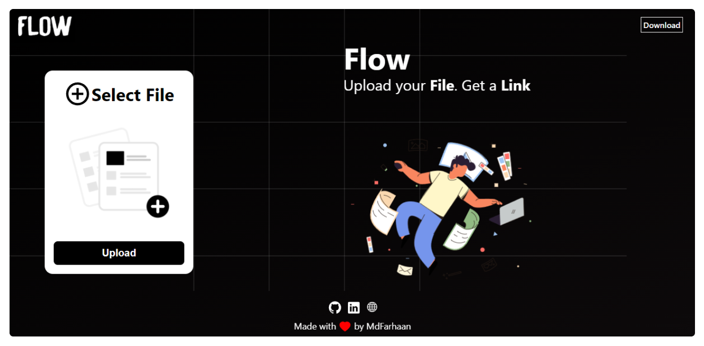

<div align="center">
  <h1 align="center">
    Flow - Cloud Share
  </h1>
<p align="center"><a href="https://www.weflow.ml/">www.weflow.ml</a> </p>

#### Upload your file and get a link to share!

</div>

Cloud sharing and storage service built using ReactJS, AWS S3 to store the uploaded files and TypeScript. Upload your file and get a link to share.

<p align='center'></p>

# Installation

This project was bootstrapped with [Create React App](https://github.com/facebook/create-react-app).
Install dependencies

```
$ npm install
```

Build Server

```
$ npm build
```

Run Server

```
$ npm start
```
